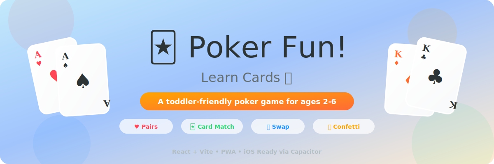

<p align="center">
  
</p>

<h1 align="center">🃏 Texas Hold'em for Kids!</h1>

<p align="center">
  <b>Learn REAL Texas Hold'em poker through toy cars, gems & crowns — designed for ages 4–9!</b>
</p>

<p align="center">
  <a href="https://poker-for-toddler.vercel.app"></a>
</p>

<p align="center">
  
  
  
  
  
</p>

---

## What Kids Learn

This isn't simplified poker — it's **real Texas Hold'em**, taught progressively through 4 themed worlds:

| Concept | How We Teach It | Kid-Friendly Version |
|---------|----------------|---------------------|
| 🃏 **10 Hand Rankings** | Visual guide + quizzes | "Royal Flush = golden crown!" |
| 🌟 **Community Cards** | Flop → Turn → River revealed step by step | "Shared cards everyone can use!" |
| 🧸 **Betting** | Toy cars, gems, unicorns, crowns | "Bet 2 toy cars!" not "Bet $20" |
| 🧠 **Best Hand Selection** | Pick best 5 from 7 cards | "Which 5 make the best team?" |
| 🔍 **Board Reading** | "Could someone have a Flush?" quizzes | "Detective mode — spot the danger!" |
| ⚖️ **Risk/Reward** | Safe vs risky toy bets | "Is it worth 3 unicorns?" |
| 🪑 **Position** | "Going last = seeing more clues" | "Be the detective, not the first guess!" |

---

## How It Works

Each hand follows the real Texas Hold'em flow:

1. **🃏 Deal** — You and the dealer each get 2 secret cards
2. **🌟 Flop** — 3 shared cards appear on the table
3. **🌟 Turn** — A 4th shared card appears
4. **🌟 River** — The 5th and final shared card
5. **👀 Showdown** — Best 5-card hand wins!

### Hand Rankings (Best → Worst)

| # | Hand | What It Means | Kid Metaphor |
|---|------|---------------|-------------|
| 👑 | **Royal Flush** | A-K-Q-J-10, same suit | The ultimate golden crown! |
| 🌈 | **Straight Flush** | 5 in a row, same suit | A rainbow staircase! |
| 🎯 | **Four of a Kind** | 4 matching cards | 4 matching toy cars! |
| 🏠 | **Full House** | 3 matching + 2 matching | A full house of friends! |
| 🎨 | **Flush** | 5 same suit, any order | A matching outfit! |
| 🛤️ | **Straight** | 5 in a row, any suit | Counting stairs! |
| 🎲 | **Three of a Kind** | 3 matching cards | A triple treat! |
| 👟👟 | **Two Pair** | 2 + 2 matching | Two pairs of matching socks! |
| 👯 | **One Pair** | 2 matching cards | Twins! |
| ☝️ | **High Card** | Nothing matches | Your tallest card stands up! |

---

## Features

- **20-level adventure** across 4 themed worlds (Card Kingdom → Champion Arena)
- **Real Texas Hold'em** — all 10 hand rankings, community cards, betting rounds
- **Toy-based betting** — stars ⭐, cars 🚗, unicorns 🦄, gems 💎, crowns 👑
- **Progressive learning** — starts with just the Flop, adds Turn/River/betting as you advance
- **Dynamic quizzes** generated from actual dealt cards
- **12 collectible badges** — pair-spotter, flush-finder, straight-star, house-builder...
- **Streak system** — every 3 wins = bonus toy
- **Free Play mode** — full Texas Hold'em without level structure
- **Hand guide** — all 10 rankings with kid-friendly explanations, always accessible
- **Toy floor of 10** — kids can never go broke
- **Progress persistence** — toys, level, badges saved to localStorage
- **No gambling language** — 100% child-safe
- **Works offline** as a PWA
- **iOS native ready** via Capacitor

---

## Quick Start

```bash
npm install
npm run dev        # http://localhost:5174 (LAN-accessible)
npm run build      # Production build
npm run preview    # Preview production build
```

---

## iOS Native Build

```bash
npx cap add ios                    # First time only
npm run build && npx cap sync ios  # Sync web build
npx cap open ios                   # Open Xcode
```

---

## Tech Stack

| Layer | Technology |
|-------|-----------|
| **UI** | React 18 + inline styles |
| **Build** | Vite 6 |
| **Font** | Fredoka One (display) + Nunito (body) |
| **PWA** | Custom service worker + web manifest |
| **iOS** | Capacitor 6 |
| **Animations** | CSS `@keyframes` — no JS animation libs |

---

## Project Roadmap

See **[PLAN.md](./PLAN.md)** for the full plan and progress tracker.

| Phase | Status | What |
|-------|--------|------|
| Core Game Engine | ✅ Done | 5-from-7 eval, all 10 hand rankings, kickers |
| Level System | ✅ Done | 4 worlds × 5 levels, progressive difficulty |
| Quiz Engine | ✅ Done | 15 quiz types from real dealt cards |
| Gamification | ✅ Done | Toys, badges, streaks, persistence |
| Betting | ✅ Done | Bet/check/fold with toy currency |
| UI/UX Polish | ✅ Done | Animations, hand guide, free play |
| Deployment | ✅ Done | Vercel + PWA + GitHub |
| iOS App | 🔜 Next | Capacitor build, App Store submission |
| Content Polish | 📋 Planned | Sound effects, card flip animations, tutorial |
| Advanced Features | 📋 Future | Multiplayer, parent dashboard, daily challenges |

---

## Also Check Out

**[Blackjack for Toddler](../blackjack-for-toddler)** — the sister game that teaches numbers and addition through simplified Blackjack!

---

<p align="center">
  Made with ❤️ for tiny card sharks 🦈
</p>
